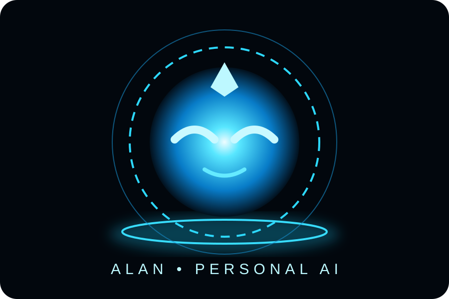
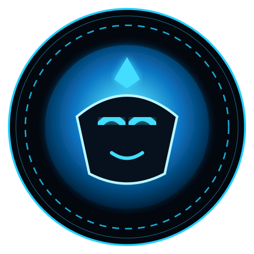

# ◈ ALAN — Personal AI 🤖

<p align="center">
  
</p>

> **⚡ Your personal AI. Your system. Your control.**

<p align="center">
  
</p>

---

## ✦ Profile

**✦ FOUNDER & CREATOR ✦**
### G.P. PRASANNA

**⚙️ MAIN DEVELOPER**  
**G.P. PRASANNA**

● PERSONAL PROJECT • 🔒 NON-COMMERCIAL • 🧠 AI • ⚡ AUTOMATION

---

## ✦ About ALAN

**ALAN** is a personal AI assistant project created and developed by **G.P. PRASANNA**.

The project is being progressively rebuilt as an **independent, modular AI system**, with individual features separated into dedicated modules for easier development, testing, and maintenance.

> 🔹 **Project:** ALAN Personal AI  
> 👤 **Founder & Creator:** G.P. PRASANNA  
> 💻 **Main Developer:** G.P. PRASANNA  
> 🔒 **Use:** Personal / Non-Commercial

---

## ⚡ Visual Identity

ALAN includes a dedicated visual asset set for project branding:

- ◈ **ALAN Emblem** — assets/alan-emblem.svg
- 🔵 **ALAN Reactor Orb** — assets/alan-orb.svg
- ✨ **Animated Showcase** — docs/alan-showcase.html

GitHub supports repository images through relative paths, so these visuals can be displayed directly in the README. The animated showcase is kept as a separate HTML experience. citeturn0search0turn0search1

---

## ⚡ Architecture

The codebase is intentionally modular so individual systems can be improved without turning ALAN into one giant Python file.

```
ALAN-Personal-AI/
│
├── ◈ alan/
│   ├── 🧠 ai/          # LLM providers and routing
│   ├── ⚙️ actions/     # Action registry and adapters
│   ├── 🔧 config/      # Identity and settings
│   ├── ◉ core/         # Application lifecycle
│   ├── 📱 dashboard/   # Phone/tablet interface
│   ├── 🧠 memory/      # Persistent memory
│   ├── 🧩 plugins/     # Plugin manager
│   ├── 🛡️ security/    # Permissions
│   ├── 💻 system/      # OS integration
│   ├── 🎨 ui/          # Desktop UI
│   ├── 🛠️ utils/       # Shared utilities
│   ├── 🎙️ voice/       # STT/TTS/audio
│   └── 🔊 wake/        # Wake-word subsystem
│
├── 🎨 assets/           # ALAN visual identity
├── 📚 docs/             # Architecture and maintenance docs
├── 🧰 scripts/          # Startup and diagnostics
├── 🧪 tests/            # Automated tests
├── 💾 data/             # Local runtime data
└── 🚀 main.py           # Small bootstrap only
```

---

## ✦ Design Principles

- 🧩 **Modular** — keep feature systems in separate modules.
- 🚀 **Simple Core** — keep main.py as a bootstrap only.
- 🛡️ **Safe Actions** — sensitive actions use permission/confirmation controls.
- 🔌 **Replaceable Components** — AI, voice, wake-word, and UI components stay modular.
- 👤 **Clear Ownership** — ALAN's project identity and ownership remain documented.

---

## 🎙️ Wake Phrases

Target phrases:

- **“Hey ALAN”** 🤖
- **“Hey man”** ⚡

Wake detection is kept behind a dedicated provider interface so the acoustic model can be changed without changing the rest of ALAN.

---

## 🟢 Project Status

**ALAN is under active development.**

The repository is being developed as an **independent, modular ALAN implementation** created by **G.P. PRASANNA**.

### Current focus

🧠 AI • 🎙️ Voice • 🧩 Modules • 💾 Memory • 💻 Computer Control • 🛡️ Security

---

## 🛠️ Local Development

```bat
python -m venv .venv
.venv\Scripts\activate
pip install -r requirements-alan.txt
python main.py
```

### 🔍 Diagnostics

```bat
scripts\diagnose.bat
```

---

## ◈ ALAN PERSONAL AI ◈

**Built & Developed by G.P. PRASANNA** ⚡

*Personal • Modular • Private • Non-Commercial*